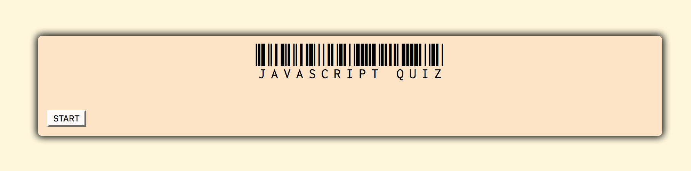
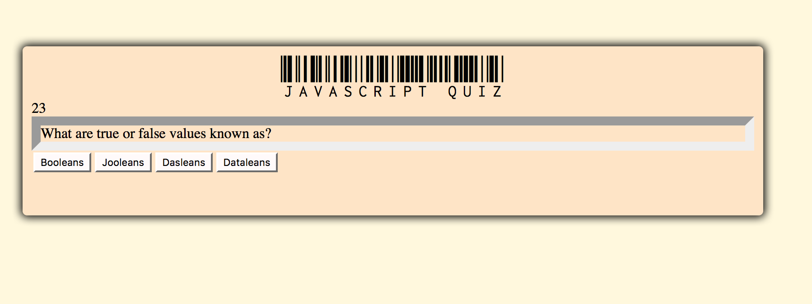
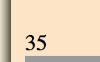
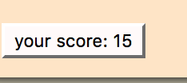

# coding_quiz

a timed quiz on JavaScript fundamentals that stores high scores
press start to begin quiz

select answer and click next

at end of quiz score is displayed and same button restarts the quiz

# assignment location
https://alihernandez.github.io/coding_quiz/

